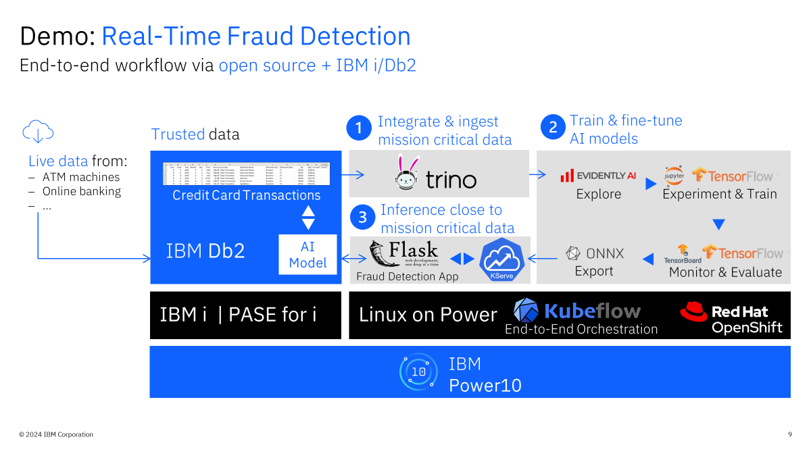
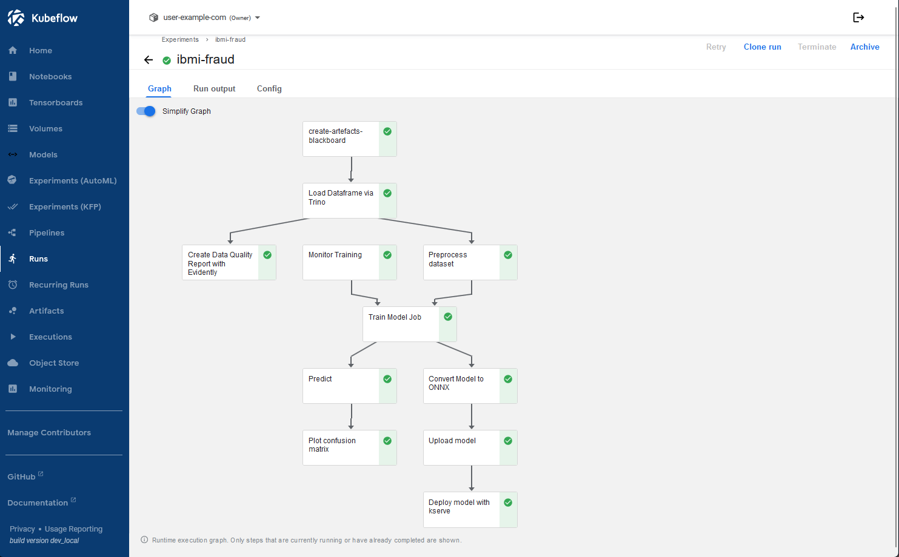
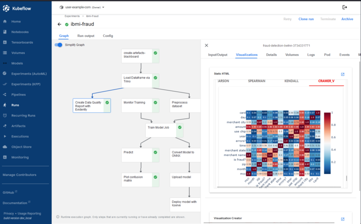
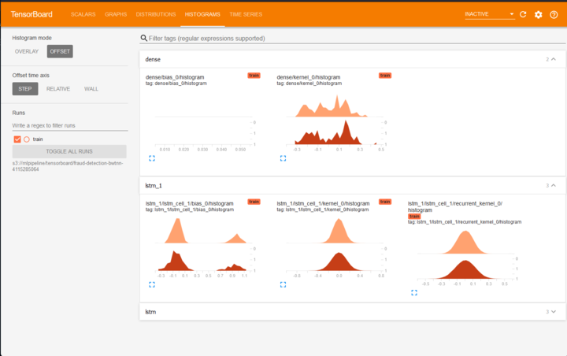
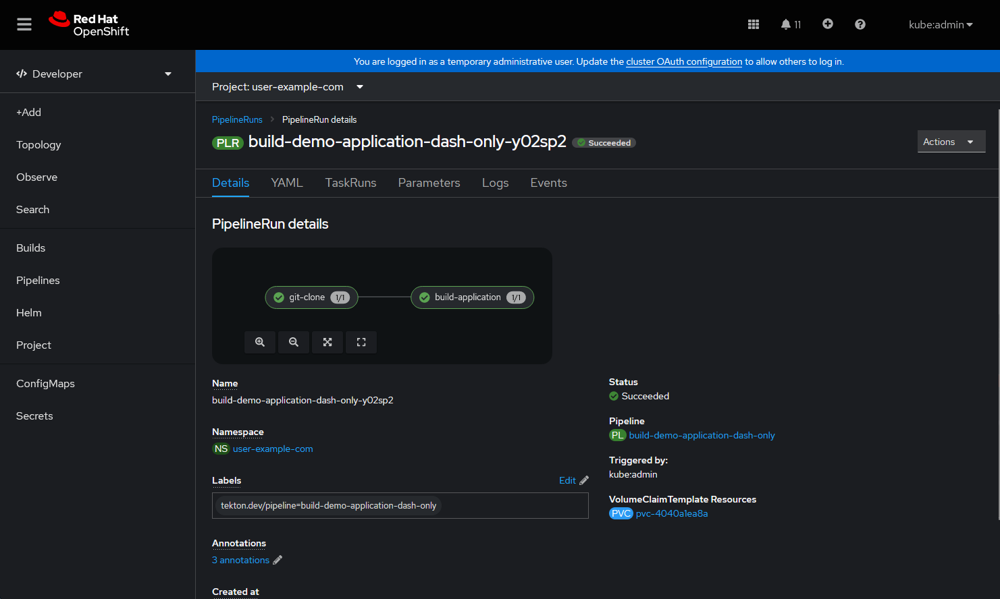
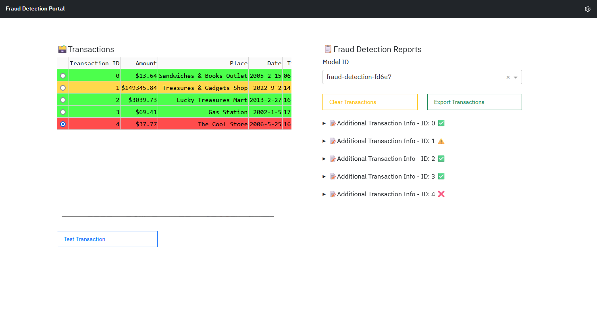
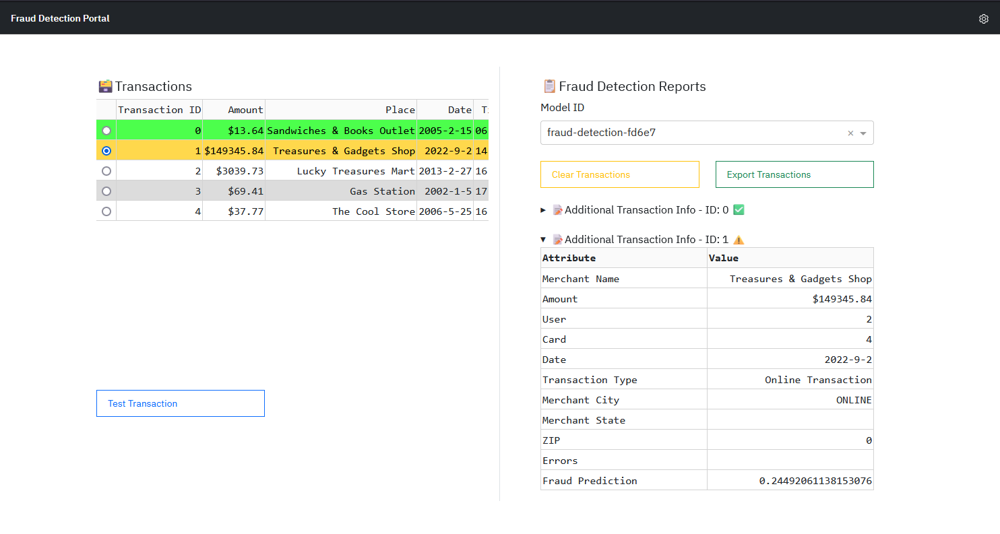

# IBM i Fraud Detection Demo
- [IBM i Fraud Detection Demo](#ibm-i-fraud-detection-demo)
- [Overview](#overview)
    - [End-to-end workflow outline](#end-to-end-workflow-outline)
  - [The Dataset 💳](#the-dataset-)
- [Installation Guide](#installation-guide)
  - [Configure Db2 for i database](#configure-db2-for-i-database)
  - [Configuring Trino and Db2 for i Connector](#configuring-trino-and-db2-for-i-connector)
- [Run Fraud Detection Pipeline](#run-fraud-detection-pipeline)
    - [Pipeline visualizations](#pipeline-visualizations)
  - [Deploy Application](#deploy-application)
    - [Build Containers and deploy to quay.io](#build-containers-and-deploy-to-quayio)
- [Using the Application](#using-the-application)
  - [Model API](#model-api)
    - [Test API from IBM i (same cluster)](#test-api-from-ibm-i-same-cluster)

# Overview

This demo contains an end-to-end AI/ML opps example that integrates IBM i and Openshift environments. In this demo, tabular transactions stored on a Db2 for i database (Db2) are used to train a fraud detection model using a reusable Kubeflow Pipeline. The model makes a "fraud" or no fraud" prediction for a given transaction. 



### End-to-end workflow outline
The end-to-end workflow covers the following steps:
1. The training data is stored inside a IBMi db2 database.
2. By applying pattern 1 and using trino, this data is integrated into the end-to-end workflow.
3. By applying pattern 3, MLOps steps continue the end-to-end workflow:
    - Explore the data using EvidentlyAI
    - Experiment and train a fraud detection model using Jupyter Lab and TensorFlow
    - Monitor model training using TensorBoard and evaluate the model using TensorFlow
    - Export the model to the ONNX format, a portable format for exchanging AI models
4. By applying pattern 2, deploy the model using KServe and connect it to a fraud detection Flask application


## The Dataset 💳 

This example data set uses a collection of transactions consisting of Online, Swipe, and Chip transaction types. 

The data is designed to be used as sample data for exploring IBM data science and AI tools. Models trained from this data are not suitable for real world applications, but the dataset is a wonderful resource for education and training use cases.

The data can be downloaded [here](https://ibm.ent.box.com/v/tabformer-data/folder/130747715605)

# Installation Guide

The assumption is that the example will be deployed on:

    Red Hat OpenShift 4.12 running on IBM Power.
    Kubeflow 1.7 or newer
    IBM Power 9 or newer hardware

The container images in this example use a Python from RocketCE with is built with optimizations for IBM Power. These images only run on Power 9 or newer hardware.

The steps to run the fraud detection Kubeflow pipeline and to deploy the applcation are outlined here. 

## Configure Db2 for i database

First and foremost, we need to upload the transaction data to an IBM i system. This can be done using Data Transfer in ACS (Access Client Solutions). More detailed approach coming. 

## Configuring Trino and Db2 for i Connector

Detailed instructions for installing Trino on OpenShift: [here](https://community.ibm.com/community/user/powerdeveloper/blogs/natalie-jann/2022/11/07/simplify-data-access-using-trino-on-ibm-power)

In order to connect Db2 with trino, we need to configure the `JTOpen` trino connector in order to use JTOpen JDBC Connection. 

Add the following configurations `trino/values.yaml`:

```yaml
additionalCatalogs:
  jtopen: |
    connector.name=jtopen
    connection-url=jdbc:as400://IP:PORT/DATABASE;date format=iso;
    connection-user=USERID
    connection-password=PASSWORD

...

# New shared volume for the plugin properties file
volumes:
  - name: trino-plugin-source
    emptyDir: {}

initContainers:
  # https://github.com/wAVeckx/trino-jtopen/releases/download/424/trino-jtopen-424.zip
  coordinator:
    - name: download-plugin
      image: quay.io/ibm/kubeflow-notebook-image-ppc64le:latest
      command:
        [
          "sh",
          "-c",
          "curl -L -o /plugins/trino-jtopen-424.zip https://github.com/wAVeckx/trino-jtopen/releases/download/424/trino-jtopen-424.zip && unzip /plugins/trino-jtopen-424.zip -d /plugins && mv /plugins/trino-jtopen-424/* /plugins/ && rm -fr /plugins/trino-jtopen-424 && rm /plugins/trino-jtopen-424.zip",
        ]
      volumeMounts:
        - name: trino-plugin-source
          mountPath: /plugins
  worker:
    - name: download-plugin
      image: quay.io/ibm/kubeflow-notebook-image-ppc64le:latest
      command:
        [
          "sh",
          "-c",
          "curl -L -o /plugins/trino-jtopen-424.zip https://github.com/wAVeckx/trino-jtopen/releases/download/424/trino-jtopen-424.zip && unzip /plugins/trino-jtopen-424.zip -d /plugins && mv /plugins/trino-jtopen-424/* /plugins/ && rm -fr /plugins/trino-jtopen-424 && rm /plugins/trino-jtopen-424.zip",
        ]
      volumeMounts:
        - name: trino-plugin-source
          mountPath: /plugins

...

```

from `~/git/charts/` run:

```bash
helm upgrade --install -n trino trino charts/trino/
```
 to update the trino deployment.

# Run Fraud Detection Pipeline
The `notebooks/Fraud_Detection_ibmi.ipynb` notebook defines all of the kubeflow components and pipeline steps to pre-process, train, test, and deploy the fraud detection model using kserve. 

Note: You may need to adjust some parameters in the notebook:
    
 - the model hash used for the pipeline run is provided by default: `fd6e7`. If you would like to test and deploy a new model for each run, use `generate_unique_hash()` which is defined at the top of the notebook:

 ```python
def generate_unique_hash():
    current_time = str(time.time())
    m = hashlib.sha256()
    m.update(current_time.encode("utf-8"))
    return m.hexdigest()[:5]

# replace with generate_unique_hash() for newly generated hash
unique_hash = "fd6e7" 
 ```

Run the notebook to start the pipeline. The notebook flow will synchronize with the completion of the pipeline. If you click on the "Run Details" Link, you will be taken to the pipeline run. This graph serves as our documentation of the deployment process. Components of the graph can visualizations that document the characteristics of the training data, model performance and test results.



### Pipeline visualizations
In the graph of the pipeline has several important visualizations that can be viewed from visualizations panel.



The Configure Tensorboard task includes a visualization with a link to a TensorBoard that monitors training in real time. The metrics displayed can be customized during training



## Deploy Application

The fraud detection inference service is automatically deployed as a step in the pipeline. The application can be deployed from the command line using `fraud-detection/deploy-fraud-demo.yaml` file provided in the repo. Follow these steps here to build the application container: 

### Build Containers and deploy to quay.io 

If it is necessary to rebuild the container images for this demo, they can be built using OpenShift Pipelines.

1. **Log on to the OpenShift Console.**

2. **Access Pipelines:**
   - Navigate to the `Developer` view.
   - Select **Pipelines** from the left sidebar.

3. **Set Your Project:**
   - In the top drop-down menu, set your Kubeflow user's project to your namespace.

4. **Create a Pipeline:**
   - Click on the `Create` dropdown on the top right.
   - Choose to **Create a Pipeline**.

5. **Configure Pipeline via YAML:**
   - In the “Configure via” section, select **YAML view**.
   - Replace the existing YAML template with the content from `fraud-detection/container_image/pipeline-build-demo.yaml`:
     - **Important Note:** This template includes an annotation to disable Istio Injection (`sidecar.istio.io/inject: "false"`). Do not remove or change this annotation.
     - Update the `namespace` in the metadata section of the template to your current project.

6. **Return to Pipeline Builder:**
   - Navigate back to the **Configure via Pipeline Builder** view.

7. **Update Pipeline Parameters:**
   - Adjust the `quay.io` repository URLs, GitHub repo, and git-tag parameters to align with your use case.

8. **Finalize and Create the Pipeline:**
   - Click **Create** to finalize the pipeline setup.

9. **Run the Pipeline:**
   - From the dropdown, select **Run the Pipeline**.
   - Adjust any parameters as needed.
   - **Set Up Authentication for quay.io:**
     - Under Advanced Options, click to create a new secret:
       - Name the secret `quay.io`.
       - Choose `Image Registry` for access type.
       - Select `Basic Authorization` for authentication type.
       - Set Server URL to `https://quay.io`.
       - Provide your User Name and Password.
       - Confirm by clicking the check mark.
   - **Start the Pipeline.**


When the pipeline has finished, the PipelineRun details will look like this:



If a component fails, you can click on the component and view the logs. Once the problem has been resolved, the pipeline can be run again.

# Using the Application

The application demonstrates the basic usage of the model by mimicking an Online Banking Portal where an admin has the ability to test transactions against the model. 



On the left is a table of transactions with a `Test Transaction` button that generates a Fraud "Report" on the right. In this example, when the Report for `ID: 1` is expanded, we see additional transaction info along with the `Fraud Prediction` score. This is the model prediction. The transaction entry on the left is then highlighted based on a set threshold for the predicted score



The Fraud Reports can be exported to JSON and cleared using the corresponding buttons on the left panel. 

## Model API

The application also has a model endpoint API for testing transactions using `curl`:
- `/api/model/infer`

```python
https://demo-application-dash-user-example-com.apps.b2s001.pbm.ihost.com/api/model/infer
```
(Note that the URL will be different)

### Test API from IBM i (same cluster)

```bash
bash-5.1$ curl  -s -w "Time Connect: %{time_connect}s\nTime Start Transfer: %{time_starttransfer}s\nTotal Time: %{time_total}s\n" -k  -X POST https://demo-application-dash-user-example-com.apps.b2s001.pbm.ihost.com/api/model/infer -H "Content-Type: application/json" -d '{
    "index": 1,
    "user": 2,
    "card": 4,
    "year": 2022,
    "month": 9,
    "day": 2,
    "time": "14:09",
    "amount": "$149345.84",
    "use chip": "Online Transaction",
    "merchant name": 3452760747765970571,
    "merchant city": "ONLINE",
    "merchant state": "",
    "zip": 0,
    "mcc": 3174,
    "errors?": "",
    "is fraud?": "Yes"
}'
```

Output:

```text
{
  "model_name": "model",
  "model_version": "3",
  "outputs": [
    {
      "data": [
        0.24492061138153076
      ],
      "datatype": "FP32",
      "name": "dense",
      "shape": [
        1,
        1
      ]
    }
  ]
}
Time Connect: 0.000949s
Time Start Transfer: 0.078666s
Total Time: 0.078903s

```
