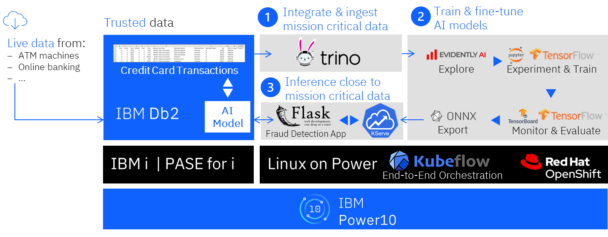

# IBM i Fraud Detection Demo

## Overview

This demo contains an end-to-end AI/ML opps example that integrates IBM i and Openshift environments. In this demo, tabular transactions stored on a Db2 for i database (Db2) are used to train a fraud detection model using a reusable Kubeflow Pipeline. The model makes a "fraud" or no fraud" prediction for a given transaction. 

## Workflow

